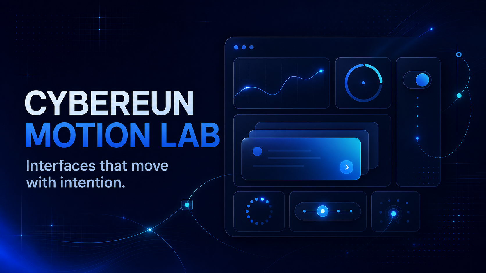

# Cybereun Motion Lab

<div align="center">
  

  <h3>Explore, interact with, and install production-ready React motion</h3>

  <p>
    Preview 178 micro-interactions in two browsing modes,<br />
    then install editable TSX source with the standalone CLI.
  </p>

  <p>
    <a href="https://cybereun-motion-lab.vercel.app"><strong>Live Demo</strong></a>
    ·
    <a href="./README.ko.md">한국어</a>
    ·
    <a href="https://github.com/cybereun/cybereun-motion-lab">GitHub</a>
    ·
    <a href="https://www.threads.com/@gogo_lebi">Threads @gogo_lebi</a>
  </p>

  <p>
    <a href="https://cybereun-motion-lab.vercel.app">
      
    </a>
    <a href="https://github.com/cybereun/cybereun-motion-lab">
      
    </a>
    <a href="./LICENSE">
      
    </a>
  </p>

  <p>
    
    
    
    
    
    
    
  </p>
</div>



## Overview

**Cybereun Motion Lab** is an interactive React motion gallery for exploring a
complete catalog at a glance, focusing on one interaction at a time, and moving
editable component source into another project.

The experience starts with a full-screen product introduction powered by a
pointer-reactive `DotField`. After entering the library, the preserved original
overview opens first. A floating view switcher lets users move to the redesigned
**Motion Gallery Studio**, where each component receives a focused preview,
search, navigation, controls, and copy actions.

The repository also ships the standalone `cybereun-motion` CLI. It reads the
bundled registry, copies selected TSX source into a React project, and installs
missing dependencies without locking the component behind a runtime wrapper.

## What changed in this edition

- Reworked the visual system around a brighter navy, cyan, violet, and black palette.
- Added a full-screen product introduction before the component library.
- Applied a reactive DotField background to the intro and overview experience.
- Added dual browsing modes: preserved overview and focused studio.
- Redesigned the studio stage, component browser, and collection summary.
- Made the center stage resize when the controls drawer opens, without blurring it.
- Added preview scale, ambient glow, and accent controls, including black.
- Increased loader contrast and kept the terminal cursor visible on light surfaces.
- Restored Card Spreads hover behavior and corrected pagination alignment.
- Removed placeholder and X links; connected GitHub and Threads `@gogo_lebi`.
- Replaced the original install and Skills pages with project-specific content.
- Added custom transparent app icons, favicons, PWA assets, and social preview.
- Added the independent `cybereun-motion` component CLI.

## Core experience

### Full-screen introduction

- Explains the product before opening the catalog.
- Uses a Canvas DotField with pointer displacement, light, sparkle, and wave feedback.
- Reduces autonomous motion under `prefers-reduced-motion` while preserving direct input feedback.
- Remains visually independent from the operating gallery.

### Two browsing modes

| View | Purpose |
| --- | --- |
| Overview | Preserves the original all-at-once gallery and opens by default |
| Detail | Opens Motion Gallery Studio for a focused, one-component workflow |

### 178 motion previews

| Collection | Count | Examples |
| --- | ---: | --- |
| Buttons | 35 | hover, press, morph, focus, blur, rotate, pulse, magnetic |
| Card Spreads & 3D Carousels | 15 | arc, fan, cascade, scatter, CoverFlow, Time Machine |
| Loaders | 128 | dots, rings, bars, shapes, text, interface, and physics loaders |
| **Total** | **178** | Searchable and interactive previews in the web gallery |

### Motion Gallery Studio

- Buttons, Card Spreads, 3D Carousels, and Loaders navigation
- Instant name-based search
- Distinct compact component previews
- Large focused interaction stage
- Precisely centered previous/next pagination
- Copy-ready implementation output
- Responsive spacing that follows the controls drawer state

### Preview controls

- Preview scale
- Ambient glow
- Blue, cyan, violet, and black accents
- No stage blur when the drawer is open
- Desktop workspace reallocation and small-screen overlap protection

### Lab Install and AI Skills

- **Lab Install** documents the real GitHub, `npm link`, initialization, and add flow.
- **AI Skills** provides copyable prompts for building, reviewing, theming, accessibility, responsive layout, and performance work.
- A project commands tab exposes real `cybereun-motion` commands.
- The pages contain no placeholder package or unrelated transitions.dev instructions.

### PWA and social identity

- Desktop and mobile installation support
- Transparent custom app icon and browser favicons
- Web app manifest and service worker
- GitHub repository link
- Threads profile link to `@gogo_lebi`

## Quick start

### Requirements

- Node.js 18 or later
- npm
- Git

### Run the website locally

```bash
git clone https://github.com/cybereun/cybereun-motion-lab.git
cd cybereun-motion-lab
npm install
npm run dev
```

Open [http://localhost:3000](http://localhost:3000).

### Verify the project

```bash
npm test
npm run lint
npm run build
```

### Preview the production build

```bash
npm run build
npm run preview
```

## Standalone CLI

### Link the CLI from a clone

```bash
git clone https://github.com/cybereun/cybereun-motion-lab.git
cd cybereun-motion-lab
npm install
npm link
```

The CLI can also be installed directly from GitHub:

```bash
npm install --global github:cybereun/cybereun-motion-lab
```

### Use it in a React project

```bash
cd my-react-project
cybereun-motion init
cybereun-motion list loader
cybereun-motion add terminal-loader
cybereun-motion doctor
```

### Commands

| Command | Purpose |
| --- | --- |
| `cybereun-motion init` | Create `motion-lab.json` and the default component directory |
| `cybereun-motion list [query]` | Browse or filter installable components |
| `cybereun-motion add <name>` | Copy TSX source and install missing dependencies |
| `cybereun-motion doctor` | Check Node.js, project configuration, and registry access |
| `cybereun-motion --help` | Show usage and original-author attribution |
| `cybereun-motion --version` | Print the CLI version |

### Options

| Option | Purpose |
| --- | --- |
| `--dir <path>` | Target a React project directory |
| `--overwrite` | Replace an existing component file |
| `--skip-install` | Copy source without installing dependencies |

The web gallery contains 178 previews. The standalone CLI currently bundles
155 registry-ready components. Installed files are written to
`src/components/motion-lab/` by default and remain fully editable.

## How to use the website

1. Move the pointer across the introduction to interact with the DotField.
2. Select **Enter Motion Lab**.
3. Start in **Overview** to scan the complete catalog.
4. Switch to **Detail** for Motion Gallery Studio.
5. Choose a category or search by component name.
6. Interact with the focused stage using hover, click, or drag.
7. Open **Controls** only when scale, glow, or accent adjustments are needed.
8. Copy implementation output or install a registry component with the CLI.
9. Open **Lab Install** and **AI Skills** for setup instructions and workflow prompts.

## Project structure

```text
cybereun-motion-lab/
├─ cli/
│  ├─ cybereun-motion.js       # Standalone Node.js CLI
│  └─ schema.json              # motion-lab.json schema
├─ public/
│  ├─ cybereun-icon.png        # Source application icon
│  ├─ favicon.*                # Browser icons
│  ├─ icon-192.png             # PWA assets
│  ├─ icon-512.png
│  ├─ manifest.webmanifest
│  ├─ og.png                   # Social preview
│  └─ sw.js                    # Service worker
├─ registry/
│  └─ ui/                      # CLI JSON and TSX registry
├─ src/
│  ├─ components/
│  │  ├─ cards/                # Card spreads and 3D carousels
│  │  ├─ CliPage.tsx           # Lab Install
│  │  ├─ DotField.tsx          # Interactive Canvas background
│  │  ├─ IntroPage.tsx         # Full-screen introduction
│  │  ├─ MotionWorkspace.tsx   # Focused studio
│  │  └─ SkillsPage.tsx        # AI Skills
│  ├─ data/                    # Button, card, and loader catalogs
│  ├─ utils/                   # Code generation and copy helpers
│  ├─ App.tsx                  # Intro and dual-view state
│  └─ OriginalGalleryApp.tsx   # Preserved overview
├─ tests/
│  ├─ cli.test.tsx             # CLI behavior
│  └─ navigation.test.tsx      # UI and navigation regressions
├─ README.md
└─ README.ko.md
```

## Technology

- React 19
- TypeScript 5
- Motion 12 and Framer Motion-compatible registry sources
- Tailwind CSS 4
- Vite 6
- Lucide React
- Canvas 2D and SVG
- Standalone Node.js CLI
- Vercel

## Deployment

Production:

**[https://cybereun-motion-lab.vercel.app](https://cybereun-motion-lab.vercel.app)**

Manual Vercel deployment:

```bash
npm run build
vercel deploy --prod -y
```

The GitHub repository can also be connected to Vercel for automatic deployment
from `main`.

## Accessibility and performance

- Semantic buttons and links
- Keyboard focus and accessible labels
- `prefers-reduced-motion` handling
- Responsive layout around the controls drawer
- Reduced rendering for out-of-view loaders
- High-contrast loader palette and visible states
- Installable PWA and service worker

## Contributing

1. Fork the repository.
2. Create a `codex/feature-name` branch.
3. Run `npm test`, `npm run lint`, and `npm run build`.
4. Open a pull request explaining the purpose and visible impact.

Use [GitHub Issues](https://github.com/cybereun/cybereun-motion-lab/issues) for
bugs and enhancement proposals.

## Credits and provenance

Personalization, the new operating UI, dual browsing modes, accessibility work,
PWA identity, documentation, and the standalone CLI are maintained by
[cybereun](https://github.com/cybereun).

This repository is based on **Amicro — Micro Transitions** by
**Syed Subhan Uddin**. The original copyright and MIT license notice are
preserved.

- Foundation: [Subhan-code/Amicro--Micro-transitions-](https://github.com/Subhan-code/Amicro--Micro-transitions-)
- Original author: [Syed Subhan Uddin / Subhan-code](https://github.com/Subhan-code)
- Interactive background reference: [DavidHDev/react-bits](https://github.com/DavidHDev/react-bits)
- Spring-motion study reference: [ckissi/kinetics](https://github.com/ckissi/kinetics)
- Current repository: [cybereun/cybereun-motion-lab](https://github.com/cybereun/cybereun-motion-lab)
- Threads: [@gogo_lebi](https://www.threads.com/@gogo_lebi)

React Bits and Kinetics are credited as external references. If their code or
assets are reused directly, consult and preserve the current terms published by
each repository.

## License

Distributed under the repository [MIT License](./LICENSE). Original Amicro
copyright notices continue to apply to derived portions.
